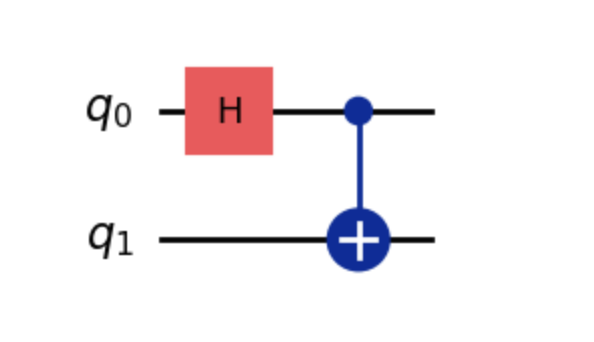
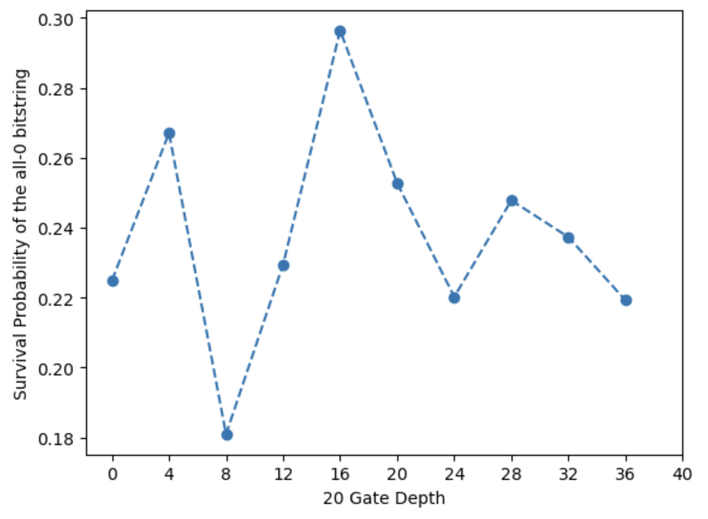
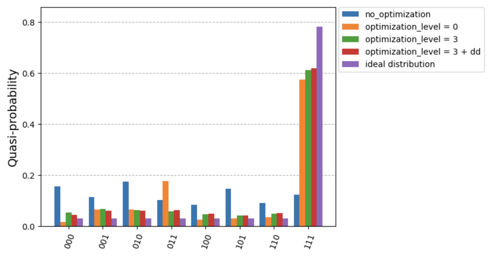
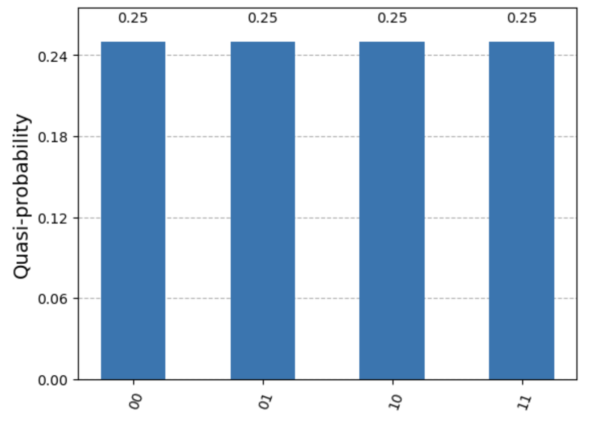
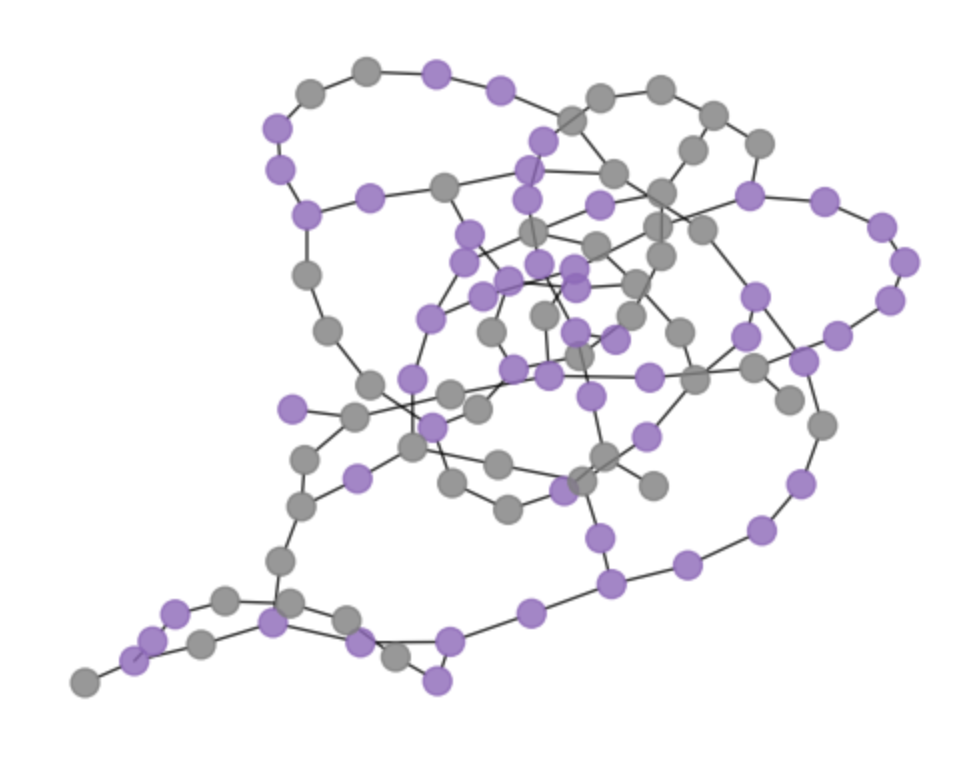
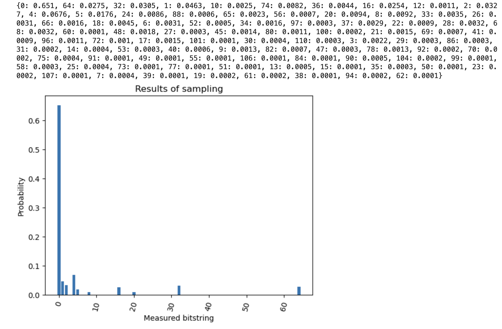

# Quantum Programs with IBM's Qiskit

This repository contains various quantum programs implemented using IBM's Qiskit framework. The programs are organized into three main sections: **Hello-world**, **Quantum-Algorithms**, and **Quantum Machine Learning**. Each notebook demonstrates different aspects of quantum computing, ranging from simple quantum circuits to more advanced algorithms and error correction techniques.

## Table of Contents
- [Overview](#overview)
- [Hello-world Programs](#hello-world-programs)
  - [QiskitHelloWorld.ipynb](#qiskithelloworldipynb)
  - [QiskitPrimitives.ipynb](#qiskitprimitivesipynb)
  - [CustomizedPrimitives.ipynb](#customizedprimitivesipynb)
  - [QiskitDynamicCircuits.ipynb](#qiskitdynamiccircuitsipynb)
- [Quantum Algorithms](#quantum-algorithms)
  - [QuantumFourierCorrelation.ipynb](#quantumfouriercorrelationipynb)
  - [GroversAlgorithm.ipynb](#groversalgorithmipynb)
  - [VariationalQuantumEigensolver.ipynb](#variationalquantumeigensolveripynb)
  - [DynamicQuantumErrorAnalysis.ipynb](#dynamicquantumerroranalysisipynb)
  - [DynamicQuantumErrorCorrection.ipynb](#dynamicquantumerrorcorrectionipynb)
  - [Quantum-Algorithms/QuantumApproximateOptimizationAlgorithm.ipynb](#quantumapproximateoptimizationalgorithm.ipynb)
- [Quantum Machine Learning](#quantum-machine-learning)
  - [QiskitPatterns.ipynb](#qiskitpatterns.ipynb)
- [Getting Started with Qiskit](#getting-started-with-qiskit)
- [License](#license)

---

## Overview

This repository contains notebooks that demonstrate quantum programming using IBM's Qiskit framework. Each notebook focuses on a different problem or technique, from basic quantum circuits to error correction algorithms. The common structure across all notebooks includes:
1. **Mapping classical systems to quantum problem statements**: Explaining how classical problems are translated into quantum algorithms.
2. **Optimization for quantum execution**: Adjusting circuit parameters, gate optimizations, and reducing depth for better quantum execution.
3. **Quantum execution using IBM backends/simulators**: Running the quantum circuits on IBM's quantum devices or simulators.
4. **Post-processing/getting back classical results**: Analyzing the measurement results, converting quantum data into useful classical information.
---

## Hello-world Programs

These are some of the programs that will help you get started with learning the basics of IBM's qiskit platform and its features. 

### 1. `QiskitHelloWorld.ipynb`
- **2-qubits GHZ state example**
- **n-qubits GHZ state example**

The **GHZ state** (Greenberger-Horne-Zeilinger) is a maximally entangled quantum state involving multiple qubits. It is commonly used to demonstrate quantum entanglement.

**Example Code:**
```python
from qiskit import QuantumCircuit 

# Creating a quantum circuit with 2 qubits: 
qc = QuantumCircuit(2)

qc.h(0)
qc.cx(0, 1)

qc.draw(output = 'mpl')
``` 
**Example Output:**




### 2. `QiskitPrimitives.ipynb`

- **Transverse field ising model**: Demonstrates how to model transverse-field Ising chains using Qiskit primitives.
- **Sampler** primitive for probabilistic measurement sampling.
- **Estimator** primitive for evaluating quantum observables, such as energy expectation values of quantum states.

**Pseudocode for Sampler Primitive:**
1. Define quantum circuit.
2. Use `Sampler/Estimator` to execute circuit on multiple backends.
3. Gather measurement samples and analyze outcomes.

**Example Code:**
```python
from qiskit.primitives import Estimator, Sampler
from qiskit.circuit.library import IsingXX
import numpy as np
```
```python
# Transverse Field Ising model
max_trotter_steps = 10
num_qubits = 100
measured_qubits = [49, 50]

qc_list = []
for trotter_step in range(max_trotter_steps):
    qc = generate_1d_tfim_circuits(num_qubits, num_trotter_steps, rx_angle, num_cl_bits=len(measured_qubits), trotter_barriers = True, layer_barriers = True)
    append_mirrored_1d_tfim_circuits(qc, num_qubits, num_trotter_steps, rx_angle, trotter_barriers = True, layer_barriers = True)
    qc.measure(measured_qubits, list(range(len(measured_qubits))))
    qc_list.append(qc)
```
**Executing on Sampler**
```python
sampler = Sampler()
result = sampler.run(circuits=ising_model).result()
counts = result.quasi_dists[0]
print(counts)
```
**Output:**



**Execution on Estimator**
```python
from qiskit.circuit import Parameter 
rx_angle = Parameter("rx_angle")
trotter_steps = 2
qc = generate_1d_tfim_circuits(num_qubits, trotter_steps, rx_angle)

from qiskit.quantum_info import SparsePauliOp

middle_index = num_qubits // 2
observable = SparsePauliOp("I" * middle_index + "Z" + "I" * (middle_index-1))
```
**Output:**


### 3. `CustomizedPrimitives.ipynb`

- **Dynamical Decoupling**: An open-loop quantum control process for decoherence suppression using rapid, time-dependent control modulation. 

Optimizing quantum circuits dynamically using **Dynamical Decoupling** helps reduce noise and improve coherence times when executing circuits on real quantum devices.

**Pseudocode for Customized Primitives:**
1. Initialize quantum circuit.
2. Apply dynamical decoupling techniques.
3. Execute optimized circuit on a backend.
4. Compare results with the non-optimized version.

```python
# Comparing different settings of transpilation for two-qubit circuits after mapping Grover's Algorithm to mark '111' state:

qc.measure_all()

twoQ_gates = set(['ecr', 'cz', 'cx'])
for gate in backend.basis_gates:
    if gate in twoQ_gates:
        twoQ_gates = gate
        
circuits = []
for optimization_level in [0, 3]:
    pm = generate_preset_pass_manager(optimization_level, backend=backend, seed_transpiler=0)
    t_qc = pm.run(qc)
    print(f"Two-qubit gates at (optimization level = {optimization_level}): ", t_qc.count_ops()[twoQ_gates])
    circuits.append(t_qc)
```
**Output:**
``Two-qubit gates at (optimization level = 0):  27``
``Two-qubit gates at (optimization level = 3):  14``

```python
# Dynamic decoupling with Optimization_level = 3

from qiskit.transpiler import PassManager
from qiskit_ibm_runtime.transpiler.passes.scheduling import (ASAPScheduleAnalysis, PadDynamicalDecoupling,)
from qiskit.circuit.library import XGate

durations = backend.target.durations() # operation time at each step
dd_sequence = [XGate(), XGate()] # minimizing environmental degenaration of the system with dynamic decoupling

pm = PassManager([ASAPScheduleAnalysis(durations), PadDynamicalDecoupling(durations, dd_sequence)])
circ_dd = pm.run(circuits[1])

circuits.append(circ_dd)

circ_dd.draw(output="mpl", style="iqp", idle_wires=False)
```
**Output:**



### 4. `QiskitDynamicCircuits.ipynb`

This notebook demonstrates **dynamic circuits** in Qiskit by implementing **long-range CNOT gate teleportation**. This shows how feedback loops and classical control can be incorporated into quantum circuits.

**Pseudocode for Dynamic Circuits:**
1. Initialize qubits and define teleportation circuit.
2. Introduce classical feedback for real-time control.
3. Execute teleportation protocol using dynamic gates.

**Example Code:**
```python
# Define get_dynamic_CNOT_circuit(num_qubits) such that the function returns a quantum circuit. 
qc = get_dynamic_CNOT_circuit(num_qubit = 7)
qc.draw(output='mpl')
```
**Output:**


---
## Quantum Algorithms

### 1. `QuantumFourierCorrelation.ipynb`

This notebook illustrates the **Quantum Fourier Transform (QFT)** to analyze correlations between qubits, producing a correlational histogram plot. The QFT is a crucial component in many quantum algorithms, such as Shor's algorithm.

**Pseudocode to execute qunatum fourier transformations:**
1. Initialize qubits in superposition.
2. Apply Hadamard gates and controlled phase gates.
3. Measure the qubits in the frequency domain.
4. Analyze correlation histogram.

**Example code:**
```python
#Define f and g:
f = [1, -1, -1, -1]
g = [1, 1, -1, -1]
circ = FourierChecking(f=f, g=g)
```
**Output:**



### 2. `GroversAlgorithm.ipynb`

- **Grover's Algorithm**: A quantum algorithm that provides a quadratic speedup for searching through unsorted databases.

**Pseudocode for Grover's Algorithm:**
1. Initialize qubits in a superposition state.
2. Apply Grover's oracle to mark the target state.
3. Apply Grover's diffusion operator.
4. Measure qubits to retrieve the marked state.

```python
#define the Oracle circuit 
def grover_oracle(marked_states): 
    if not isinstance(marked_states, list): 
        marked_states = [marked_states]
    
    num_qubits = len(marked_states[0])
    
    qc = QuantumCircuit(num_qubits)
    
    for target in marked_states: 
        rev_target = target[::-1]
        zero_inds = [ind for ind in range(num_qubits) if rev_target.startswith('0', ind)]
        qc.x(zero_inds)
        qc.compose(MCMT(ZGate(), num_qubits - 1, 1), inplace = True)
        qc.x(zero_inds)
        
    return qc

# Instantiation 
marked_states = ['001', '110']

oracle = grover_oracle(marked_states)
oracle.draw(output = "mpl")
```
**Output:**


### 3. `VariationalQuantumEigensolver.ipynb`

- **Variational Quantum Eigensolver (VQE)**: A hybrid quantum-classical algorithm used to find the minimum eigenvalue of a **Hamiltonian**, widely used in quantum chemistry for evaluating the energy states of molecules.

**Pseudocode to find eigenvalues of a Hamiltonian with variational quantum execution:**
1. Initialize a parameterized quantum circuit.
2. Classically optimize the parameters to minimize the energy.
3. Measure the final energy and optimize iteratively.

**Example code:**
```python
from qiskit.circuit.library import RealAmplitudes
from qiskit.algorithms import VQE
from qiskit.opflow import X, Z

# Define Hamiltonian (Pauli Operators)
hamiltonian = Z ^ Z + X ^ X
ansatz = RealAmplitudes(2, reps=2)

# Variational Quantum Eigensolver
vqe = VQE(ansatz, optimizer='COBYLA')
result = vqe.compute_minimum_eigenvalue(operator=hamiltonian)
print(result.eigenvalue)
```
**Output:**


### 4. `DynamicQuantumErrorAnalysis.ipynb`

Explores **dynamic quantum error analysis**, where R_{X} gate errors are analyzed probabilistically, and errors are corrected dynamically using feedback mechanisms.

**Pseudocode to implement dynamic error analysis:**
1. Apply quantum gates with probabilistic errors.
2. Detect errors and apply corrections.
3. Reset qubits and repeat the process if errors occur.

```python
# Success := |0>, P_success = 5/8; Failure := |1>, P_failure = 3/8
# reset_controls if failure == True
def reset_controls(circuit, controls, measures):
    with circuit.if_test((measures[0], True)):
        circuit.x(controls[0])
    with circuit.if_test((measures[1], True)):
        circuit.x(controls[1])
```
**Circuit diagram:**
**Output:**
```
Expected success rate: 0.859
Actual success rate: 0.367
```

### 5. `DynamicQuantumErrorCorrection.ipynb`

Focuses on **bit-flip error correction** for qubits, detecting errors using parity checks.

**Pseudocode flipped-bits for parity checks:**
1. Prepare qubit and set up error detection circuits.
2. Apply error detection and correction.
3. Measure corrected qubit state and repeat if necessary.

**Example code:**
```python
def apply_final_readout(circuit, qreg_data, creg_data):
    circuit.barrier(qreg_data)
    circuit.measure(qreg_data, creg_data)
    return circuit
```

**Output:**
```
Completed bit code experiment data measurement counts (no correction): {'001': 15, '101': 283, '111': 642, '110': 12, '100': 11, '011': 22, '010': 13, '000': 2}
Completed bit code experiment syndrome measurement counts (no correction): {'01': 285, '00': 686, '11': 13, '10': 16}
Bit-flip errors were detected/corrected on 314/1000 trials.
A final parity error was detected on 356/1000 trials.

Completed bit code experiment data measurement counts (corrected): {'111': 840, '000': 11, '110': 22, '011': 86, '101': 33, '010': 2, '100': 3, '001': 3}
Completed bit code experiment syndrome measurement counts (corrected): {'01': 25, '00': 929, '10': 35, '11': 11}
Bit-flip errors were detected/corrected on 71/1000 trials.
A final parity error was detected on 149/1000 trials.
```

### 6. `QuantumApproximateOptimizationAlgorithm.ipynb`

**Optimization** algorithms executed using quantum computers, taking the **maximum-cut problem** from combinatorics as an example. 

**Pseudocode for QAOA:**
1. Initialize qubits in a superposition state.
2. Define the cost Hamiltonian.
3. Define the mixer Hamiltonian.
4. Apply alternating layers of cost and mixer Hamiltonians.
5. Measure the qubits.
6. Classical optimization loop. 

**Example sampling code:**

```python
# Extracting lowest-cost solution
_PARITY = np.array([-1 if bin(i).count("1") % 2 else 1 for i in range(256)], dtype=np.complex128)

def evaluate_sparse_pauli(state: int, observable: SparsePauliOp) -> complex: 
    # Evaluation of the expectation value of a measured state
    packed_uint8 = np.packbits(observable.paulis.z, axis=1, bitorder="little")
    state_bytes = np.frombuffer(state.to_bytes(packed_uint8.shape[1], "little"), dtype=np.uint8)
    reduced = np.bitwise_xor.reduce(packed_uint8 & state_bytes, axis=1)
    return np.sum(observable.coeffs * _PARITY[reduced])

def best_solution(samples, hamiltonian):
    min_cost = 1000
    min_sol = None
    for bit_str in samples.keys():
        candidate_sol = int(bit_str)
        fval = evaluate_sparse_pauli(candidate_sol, hamiltonian).real
        if fval <= min_cost:
            min_sol = candidate_sol
            
    return min_sol

best_sol_100 = best_solution(final_distribution_100_int, cost_hamiltonian_100)
best_sol_bitstring_100 = to_bitstring(int(best_sol_100), len(graph_100))
best_sol_bitstring_100.reverse()

print("Result bitstring:", best_sol_bitstring_100)
```

**Output:**



---
## Quantum Machine Learning

### 1. `QiskitPatterns.ipynb`

This notebook explores **quantum circuit patterns** and how they can be leveraged for machine learning tasks. The examples provided demonstrate how to apply different quantum gate patterns to qubit systems to build foundations for quantum machine learning algorithms like **Quantum Support Vector Machines (QSVM)** and **Quantum Neural Networks (QNN)**.

**Pseudocode to build quantum machine learning circuits:**
1. Initialize the quantum register and classical register.
2. Apply variational forms using quantum gates (e.g., RX, RY).
3. Create entangling layers between qubits.
4. Measure qubits and analyze the results using classical machine learning models.

**Example code:**
```python
# Feature map to compute overlap
num_features = np.shape(X_train)[1]
num_qubits = int(num_features/2)
entangler_map = [[0,2],[3,4],[2,5],[1,4],[2,3],[4,6]]
fm = QuantumCircuit(num_qubits)
training_param = Parameter("θ")
feature_params = ParameterVector("x", num_qubits*2)
fm.ry(training_param, fm.qubits)

for cz in entangler_map:
    fm.cz(cz[0], cz[1])
for i in range(num_qubits):
    fm.rz(-2 * feature_params[2*i+1], i)
    fm.rx(-2 * feature_params[2*i], i)
```

**Output:**



---

## Getting Started

### Prerequisites

To run the notebooks in this repository, you will need to have the following software installed:

1. **Qiskit:** IBM's quantum computing SDK.

   You can install Qiskit using pip:

   ```bash
   pip install qiskit
   ```
   The code can be run using Jupyter Notebooks or a native python environment.

  ```bash
  pip install notebook
  ```

2. **Running the programs:** 

   ```bash
   git clone https://github.com/your-username/qiskit-quantum-programs.git
   ```
   ```bash
   cd qiskit-quantum-programs
   ```

  Launch jupyter notebooks:

   ```bash
   jupyter notebook
   ```

  Open any of the notebooks and run the cells to execute the quantum programs.

   ```py
  qiskithelloworld.ipybn
  ```

---

## License

This repository is licensed under the Apache 2.0 License. See the `LICENSE.TXT` file for more information.
